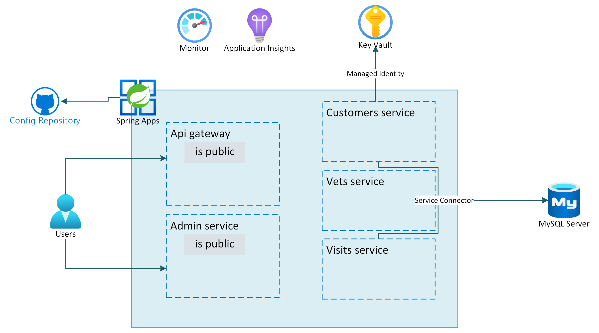

## Review
In this lab you implemented:
- Create an Azure Key Vault instance
- Store your connection string elements as Azure Key Vault secrets
- Create a managed identity for your microservices
- Grant the managed identity permissions to access the Azure Key Vault secrets
- Update application config
- Update, rebuild, and redeploy each app
- Delete secrets from Key Vault
- Create an admin account for the MySQL Flexible Server
- Create service connections from the microservices to the database server
- Update the applications to use passwordless connectivity

The below image illustrates the end state you have build in this lab.

