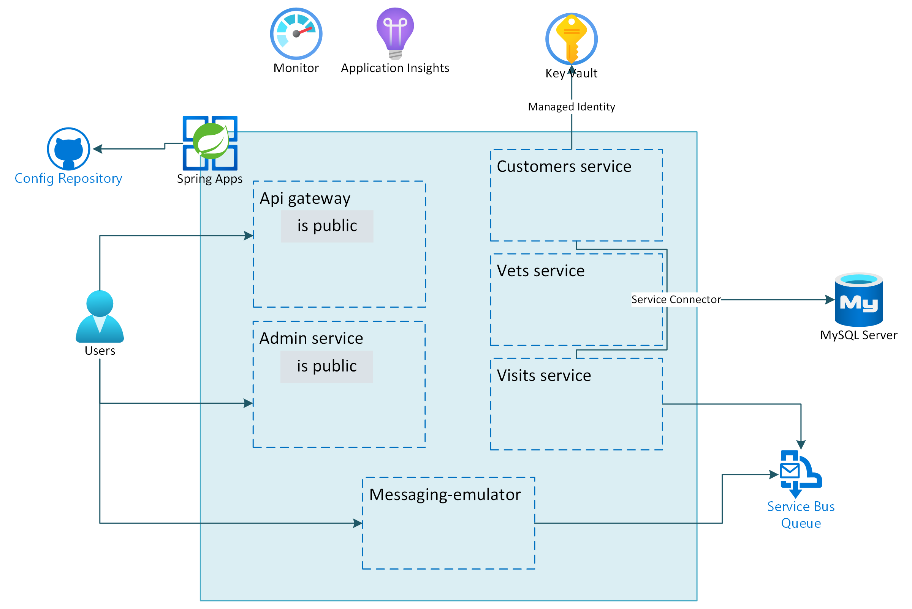

# Challenge 05: Create and configure Azure Service Bus for Azure Spring Apps

# Student manual

## Challenge scenario

You have now set up and deployed the Spring Petclinic application. Some of the microservices however also need to send messages to a third party system over a message bus and you want to enable an intake of telemetry events. You want to provide this functionality with native Azure services such as Azure Service Bus and Azure Event Hub. You will start by implementing support for outbound messaging.

## Objectives

After you complete this challenge, you will be able to:

- Create Azure Service Bus resources
- Test the messaging functionality
- Update the remaining microservice to use the message queues
- Add the message producers and listeners

The below image illustrates the end state you will be building in this challenge.

