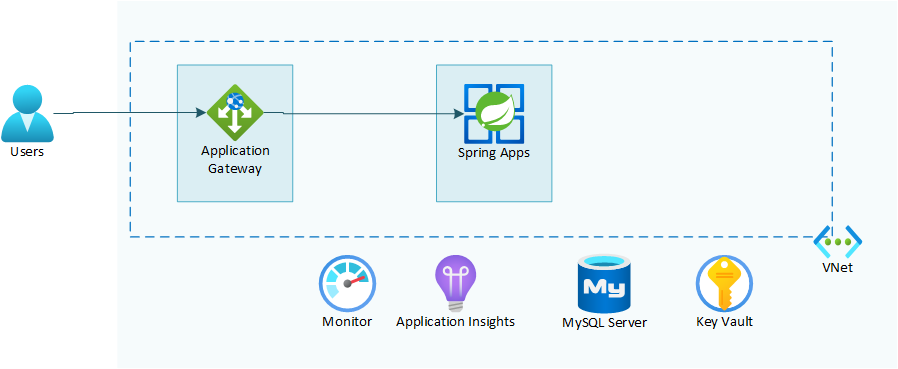

# Lab 07: Protect endpoints using Web Application Firewall

# Student manual

## Lab scenario

By now, you have completed setting up your Spring Petclinic application in Azure, secured the secrets used by the microservices, and used passwordless connections to connect to their data store. You are satisfied with the results, but you do recognize that there is still room for improvement. In particular, you are concerned with the public endpoints of the application which are directly accessible to anyone with access to the internet. You would like to add a Web Application Firewall to filter incoming requests to your application. In this exercise, you will step through implementing this configuration.

## Objectives

After you complete this challenge, you will be able to:

- Create networking resources
- Recreate Azure Spring Apps service and apps in the virtual network
- Configure a private DNS zone
- Acquire a certificate and add it to Key Vault
- Configure a domain in Azure Spring Apps
- Create the Application Gateway resources
- Access the application by DNS name
- Configure WAF on Application Gateway

The below image illustrates the end state you will be building in this challenge.

## Challenge Duration

- **Estimated Time**: 60 minutes

## Instructions

During this challenge, you will:

- Create networking resources
- Recreate Azure Spring Apps service and apps in the virtual network
- Configure a private DNS zone
- Acquire a certificate and add it to Key Vault
- Configure a domain in Azure Spring Apps
- Create the Application Gateway resources
- Access the application by DNS name
- Configure WAF on Application Gateway

   > **Note**: The instructions provided in this exercise assume that you successfully completed the previous exercise and are using the same lab environment, including your Git Bash session with the relevant environment variables already set.
