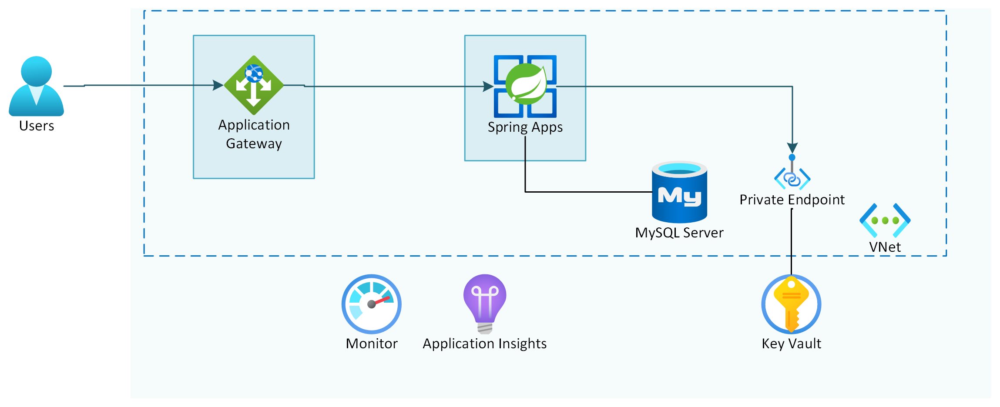

# Lab 08: Secure MySQL database and Key Vault using a Private Endpoint

# Student manual

## Challenge scenario

You now have your Azure Spring Apps service deployed into a virtual network and the microservices connection requests from the internet must pass through your Application Gateway instance with Web Application Firewall enabled. However, the apps communicate with the backend services, such Azure Database for MySQL Flexible Server, Key Vault, Service Bus and Event Hub via their public endpoints. In this exercise, you will lock them down by implementing a configuration in which they only accept connections that originate from within your virtual network.

## Objectives

After you complete this challenge, you will be able to:

- Lock down the Azure Database for MySQL Flexible Server instance by using a private endpoint
- Lock down the Key Vault instance by using a private endpoint
- Test your setup

The below image illustrates the end state you will be building in this challenge.

## Challenge Duration

- **Estimated Time**: 60 minutes

## Instructions

During this challenge, you will:

- Lock down the Azure Database for MySQL Flexible Server instance by using a private endpoint
- Lock down the Key Vault instance by using a private endpoint
- Test your setup

    > **Note**: The instructions provided in this exercise assume that you successfully completed the previous exercise and are using the same lab environment, including your Git Bash session with the relevant environment variables already set.

    > **Note**: Since adding private endpoints to services is very similar across services, we will leave locking down the Service Bus and Event Hub namespace as an additional exercise for you, without adding the step by step instructions.
